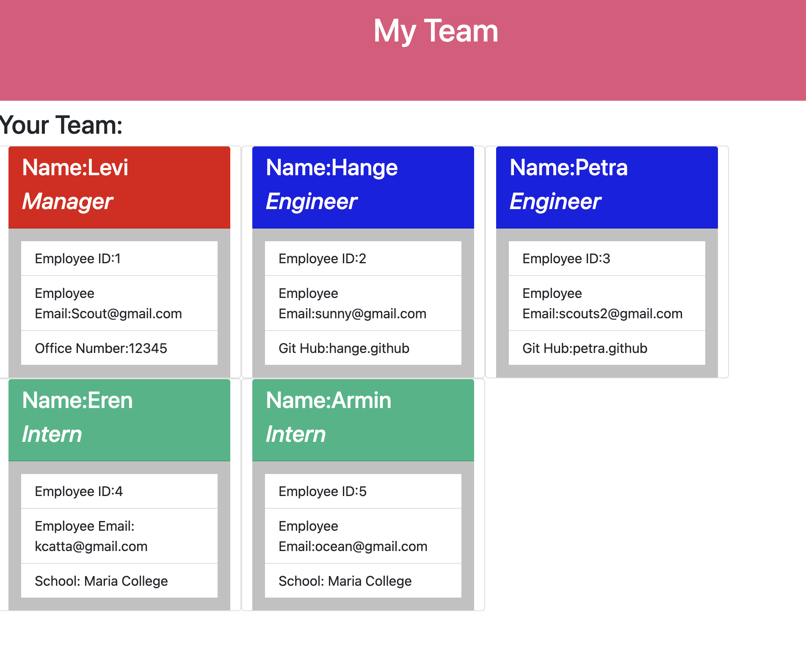

# TeamProfile

# Table Of Content:
* [ProjectDescription](#ProjectDescription)
* [ProjectInstallationInstructions](#ProjectInstallationInstructions)
* [ProjectUsage](#ProjectUsage)
* [ProjectContributors](#ProjectContributors)
* [ProjectTest](#ProjectTest)
* [License](#Projectlicense)
* [ContactInformation](#ContactInformation)

# ProjectDescription
* Using Inquiere we willl be able to create a Team profile generator Based on the answer provided in Node,
* These answer will then be converted into a HTML page for easy viewing.

# ProjectInstallationInstructions
* To Utilize the Application simply fork the repository and then you can use the app,assure a npm install is preformed 
* Usage Video : https://drive.google.com/file/d/1eiyAfl_d98THhTu6PfnNK_cYWlAWPhMy/view?usp=sharing

# ProjectUsage
* To create a HTML page base on User input.

# ProjectContributors
* No contributors

# ProjectTest
* Total of 4 test are included within this repo. Use Jest and rin.

# ProjectLicense
* No License

# ContactInformation
* If you have question or would like to contact the project creator please:
    *  Get Visit Git Hub profile at: (https://github.com/Jacqueline8996)
    *  Email at: Jacqueline8996@gmail.com;